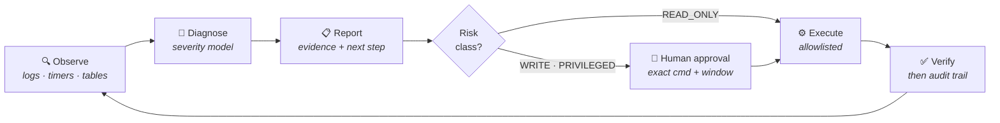

<h1 align="center">Juan Manuel Velásquez Terreros</h1>

<p align="center">
  <b>Electronic Engineer · M.Sc. Candidate in Artificial Intelligence &amp; Data Science</b><br>
  Universidad Autónoma de Occidente — Colombia
</p>

<p align="center">
  I build <b>agentic systems</b> that observe, diagnose and safely operate<br>
  production data pipelines — with the guardrails production actually requires.
</p>

<p align="center">
  
  
  
  
  
  
  <a href="https://www.linkedin.com/in/ing-juan-vel%C3%A1squez-577471243"></a>
</p>

---

## 🤖 Agentic Operations

Most "AI agent" demos stop at the prompt. My work starts where it gets hard: an
agent with real credentials, on a real server, that must never break anything.



| Discipline | How it shows up in the code |
| :--- | :--- |
| **Spec-driven** | Every feature ships as `spec → plan → tasks` *before* a line of code |
| **AgentOps** | Command allowlists, approval gates, sandboxing, least-privilege SSH, audit ledger |
| **LLMOps** | Model judgment (alert severity, secret redaction) pinned by versioned golden cases in CI |
| **Fail-closed** | Missing config, ambiguous state or unknown command → refuse, never guess |
| **Secret hygiene** | Zero credentials in code, logs, prompts or reports — enforced by CI scanning |

---

## 🧭 Focus Areas

<table>
<tr>
<td width="33%" valign="top">

### 🛰️ Data Pipelines
Multi-source ETL, freshness &amp;
volume checks, load-control
tables, scheduled orchestration
and real-time incident alerting.

</td>
<td width="33%" valign="top">

### 🧠 Machine Learning
NLP &amp; deep learning
(Word2Vec, RNN/LSTM),
computer vision (YOLOv8),
ensemble models in production.

</td>
<td width="33%" valign="top">

### ⚡ Systems &amp; Embedded
Linux servers, WSL2, systemd,
circuit design and embedded
controllers — hardware-level
intuition applied to software.

</td>
</tr>
</table>

---

## 📊 Activity

<div align="center">

<picture>
  <source media="(prefers-color-scheme: dark)" srcset="https://streak-stats.demolab.com?user=JuanMa0912&theme=tokyonight&hide_border=true&date_format=j%20M%5B%20Y%5D">
  
</picture>

<picture>
  <source media="(prefers-color-scheme: dark)" srcset="https://github-profile-summary-cards.vercel.app/api/cards/most-commit-language?username=JuanMa0912&theme=tokyonight">
  
</picture>
<picture>
  <source media="(prefers-color-scheme: dark)" srcset="https://github-profile-summary-cards.vercel.app/api/cards/repos-per-language?username=JuanMa0912&theme=tokyonight">
  
</picture>

<picture>
  <source media="(prefers-color-scheme: dark)" srcset="https://github-readme-activity-graph.vercel.app/graph?username=JuanMa0912&theme=tokyo-night&hide_border=true&area=true">
  
</picture>

</div>

---

## 🚀 Selected Work

| Project | What it does | Stack |
| :--- | :--- | :--- |
| **[os-system-agent](https://github.com/JuanMa0912/os-system-agent)** | Controlled agent that monitors ETL jobs on remote servers so operators stop SSH-ing into production for routine checks. Spec-driven, approval-gated, fully auditable. | `Python` `SSH` `SQLite` `CI` |
| **[visor-productividad](https://github.com/JuanMa0912/visor-productividad)** | Operational productivity dashboard over live business data. | `TypeScript` `PostgreSQL` |
| **[sentiment-analysis-word2vec-rnn-lstm](https://github.com/JuanMa0912/sentiment-analysis-word2vec-rnn-lstm)** | Comparative study of ML vs. deep learning for binary sentiment classification on IMDb 50K. | `Word2Vec` `RNN/LSTM` |
| **[waste-sorting-with-YOLOv8](https://github.com/JuanMa0912/waste-sorting-with-YOLOv8-and-Roboflow)** | Computer-vision waste classification pipeline trained on a custom annotated dataset. | `YOLOv8` `Roboflow` |
| **[ETL-PROJECT](https://github.com/JuanMa0912/ETL-PROJECT)** | End-to-end extract–transform–load solution for a real analytics problem. | `Python` `SQL` |
| **[Proyecto_final_ML](https://github.com/JuanMa0912/Proyecto_final_ML)** | Interactive app predicting employee attrition with a stacking ensemble. | `Streamlit` `scikit-learn` |

---

## 🛠️ Toolbox

```text
Languages     Python · SQL · TypeScript · Shell
AI / ML       scikit-learn · TensorFlow · pandas · NumPy
Agentic       LLM tool-use · MCP · spec-driven workflows · eval harnesses
Data          PostgreSQL · MySQL · SQLite · Airflow · Power Query
Ops           Linux · WSL2 · systemd · Docker · Git · CI/CD · Postman
Hardware      Circuit design · embedded controllers
```

---

<p align="center">
  <a href="https://www.linkedin.com/in/ing-juan-vel%C3%A1squez-577471243"><b>LinkedIn</b></a>
  &nbsp;·&nbsp;
  <a href="mailto:junchocaliv@gmail.com"><b>junchocaliv@gmail.com</b></a>
  &nbsp;·&nbsp;
  <a href="https://github.com/JuanMa0912?tab=repositories"><b>All repositories</b></a>
</p>

<p align="center"><sub><i>Observe → diagnose → report → ask → act → verify.</i></sub></p>
